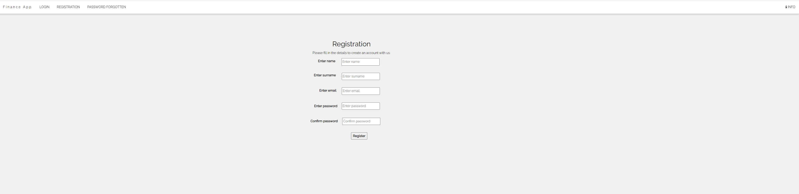
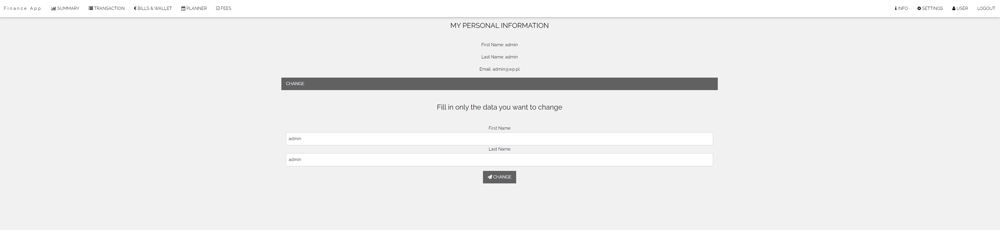

# API - Finance App

## Financial management app

A financial application project created to record income, expenses and saving savings, and then analyze the data entered by the user.

### Application Pages

Before logging in:

- User login

- Registration of new users

- Ability to create a new password

- Application information

After logging in:

- Summary page

- Transaction page

- Page with savings for larger expenses

- A page with estimated expenses for each category

- Fees page

- Application information

- Settings page

- User data page

### Application possibilities

- **Registration of new users:** To be able to add a new user, you must provide your name, surname, e-mail address and password with its confirmation. When adding values ​​to the designated fields, the correctness of the entered data is verified. The e-mail address is validated because to add a user, it must be confirmed in the e-mail.The password is checked for length and correctness against the password confirmation. The name and surname cannot be empty, after adding a user, it will be possible to correct personal data on the appropriate tab of the application. After entering incorrect data, an appropriate error message will be displayed and information on what needs to be corrected.
After entering the data correctly, you will be asked to go to your e-mail and confirm that you want to create a new account for the financial application.
There will be a `VERIFY` button in the e-mail, clicking on which will redirect us to a page with information about the success or failure of adding a new user. If we wait too long, we will have to re-register the user. If we do everything according to the displayed information, we will see a page with information about the successful registration of our new user.

- **Forgotten password to our account:** there may be a situation where, after creating an account in our financial application, we forget the login password.
The solution to this problem is the functionality of creating a new password for our account. We can do this by going to the FORGOT PASSWORD tab. We have the option to enter our email address to generate a verification message if we really want to change the password.
After entering our mailbox, we will see a message informing us that we have attempted to change the password in our financial application. After clicking the `CHANGE` button, we will be transferred to a page where we can enter a new password along with its confirmation.
On the website, the data entered is checked for correctness and in the case of incorrectly entered data, we will be informed about it with an appropriate message.
After entering the data correctly and changing the password, re-entering the previously generated link to the password change page will no longer be possible, thanks to which we are protected against unauthorized changes to our account without our knowledge.

- **Login to the application:** To log in to our financial application, you need to enter your login and password.
The identifier of each user is his e-mail address. There can't be two users in the app with the same email address. The password is entered during registration. We have two types of users in our application. One is a user with normal permissions and these will always be entered through registration. 
The second type of user is the administrator, i.e. the user whose type we will change with an entry in the database. After entering incorrect data when logging in, we will be informed about it by an appropriate message on the website.

- **Page with completed financial transactions:** we have the ability to add entries related to spending or earning our money. After clicking on add transaction, you will be asked to enter the transaction title, transaction date, transaction category and amount. All these data are checked for correctness and if we enter incorrect values, we will be informed about it with an appropriate message. After accepting the entered transaction, it will appear in the list below. Two actions are possible for each entry.
`UPDATE` is used for possible correction of the entered data. An additional tab will then appear, allowing you to enter the correct data, and then the specific entry will be corrected.
`DELETE` it is used to get rid of an entry if you want to withdraw from a previously added transaction. 
The CATEGORY column displays the categories of our transaction in capital letters, and the subcategories of what our transaction is about in lowercase letters.
The AMOUNT column displays a negative amount if it is an expense and a positive amount if it is an income according to a given transaction category.
The entered data affects what is displayed on the SUMMARY tab and on the other tabs.

- **A page with the possibility of saving money for larger expenses:** we have the option to add an entry with expected expenses in the future. If we know that in six months we will want to spend a certain amount, e.g. on a trip, this functionality is just for that. Just enter the title, amount and planned date. The entered data is verified in terms of the correctness of the entered values ​​and compliance with the previously entered values ​​on other tabs.
After adding the entry we are interested in with the deposit amount, display it to us in the table below.
We have the option of withdrawing from the entry after the intended expenditure has been made using the `DELETE` button.
The user's total budget displayed is reduced by the amounts deposited in our wallet, so we always know how much we can spend without affecting the amount we have deposited.

- **A page with estimated expenses for each category:** The planner is used to estimate the user's future expenses for each category. It is enough to add the category we are interested in, the expected amount and a short comment and we can check whether we spend more, less or exactly as planned. This is a place where the user can verify what he spends too much on or where he can afford to spend more.
In the REAL EXPENSES column, we display the sum of expenses for a given category
In the DIFFERENCE column, we display the differences between our estimates and actual expenses.
In the STATUS column we are informed whether the amount has been exceeded or not.

- **Fees page:** thanks to the ADD FEES tab, we are able to add values ​​such as: when the payment is to be made, for which we make the payment, i.e. category, fee title and fee amount. After adding the above data, the entry will appear in the MY FEES tab. Fees are included in the user's total budget. The status informs us whether the payment has been made or not.
The DISTRIBUTORS tab contains all possible institutions that we are able to choose to add our fee.

- **User page:** this is the page where we see our user details, our name, surname and email.
We are able to change our name if necessary. Just click on `CHANGE` and enter the values ​​you are interested in.

- **Logout button:** after logging out, we return to our home page, where we can log in, add a new user or change the password of an existing one.

  
## Application demo

### Registration of new users

### Confirmation of new user registration by e-mail

### Ability to create a new password

### Confirmation of password change by e-mail

### Confirmation of creating a new password

### Transaction page

### Page with savings for larger expenses

### A page with estimated expenses for each category

### Fees page

### User page

>The financial application is still being developed and improved.
